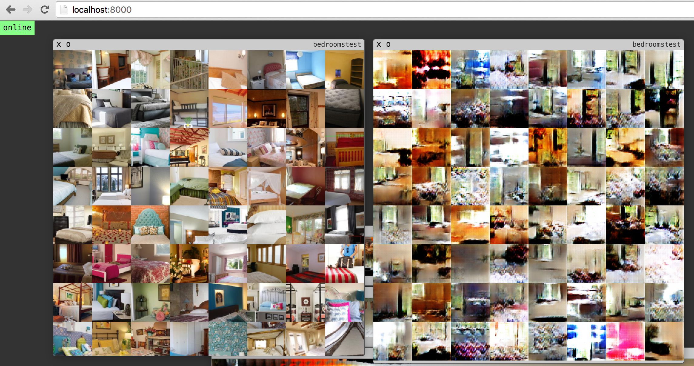
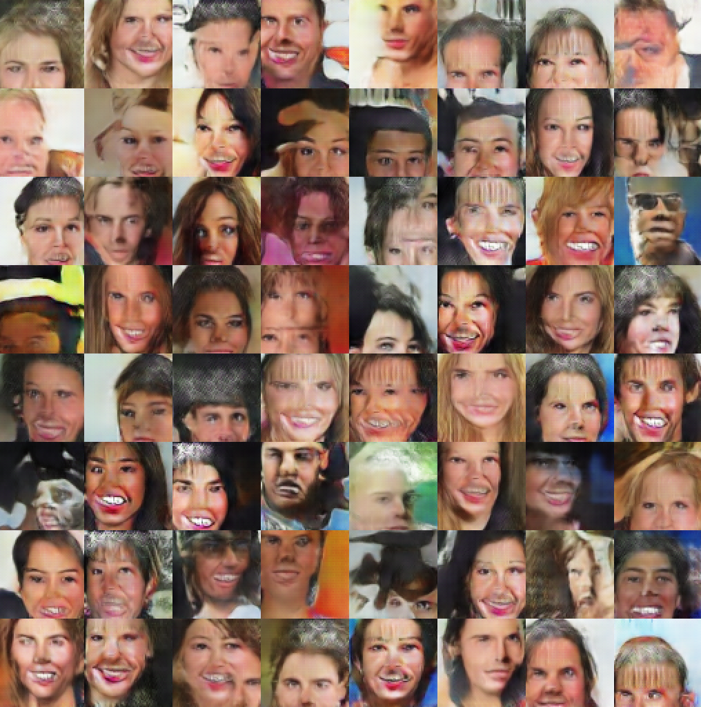
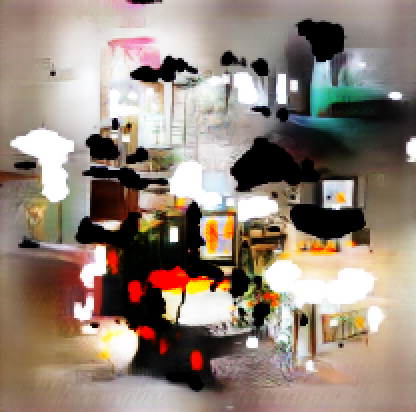
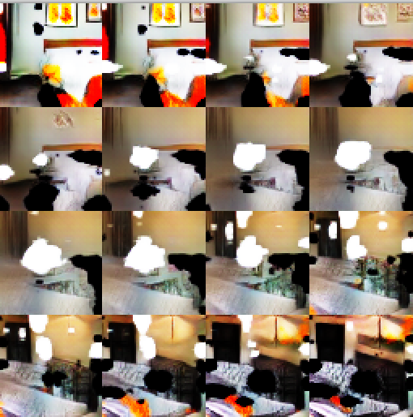

DCGAN.torch: Train your own image generator
===========================================================

1. [Train your own network](#1-train-your-own-network)
   1. [Train a face generator using the Celeb-A dataset](#11-train-a-face-generator-using-the-celeb-a-dataset)
   2. [Train Bedrooms, Bridges, Churches etc. using the LSUN dataset](#12-train-bedrooms-bridges-churches-etc-using-the-lsun-dataset)
   3. [Train a generator on your own set of images.](#13-train-a-generator-on-your-own-set-of-images)
   4. [Train on the ImageNet dataset](#14-train-on-the-imagenet-dataset)
2. [Use a pre-trained generator to generate images.](#pre-trained-network-can-be-downloaded-from-here)
   1. [Generate samples of 64x64 pixels](#21-generate-samples-of-64x64-pixels)
   2. [Generate large artsy images (tried up to 4096 x 4096 pixels)](#22-generate-large-artsy-images-tried-up-to-4096-x-4096-pixels)
   3. [Walk in the space of samples](#23-walk-in-the-space-of-samples)

# Prerequisites
- Computer with Linux or OSX
- Torch-7
- For training, an NVIDIA GPU is strongly recommended for speed. CPU is supported but training is very slow.

# Installing dependencies
## Without GPU
- Install Torch:  http://torch.ch/docs/getting-started.html#_

## With NVIDIA GPU
- Install CUDA, and preferably CuDNN (optional).
  - Instructions for Ubuntu are here: [INSTALL.md](INSTALL.md)
- Install Torch:  http://torch.ch/docs/getting-started.html#_
- Optional, if you installed CuDNN, install cudnn bindings with `luarocks install cudnn`

## Display UI
Optionally, for displaying images during training and generation, we will use the [display package](https://github.com/szym/display).

- Install it with: `luarocks install https://raw.githubusercontent.com/szym/display/master/display-scm-0.rockspec`
- Then start the server with: `th -ldisplay.start`
- Open this URL in your browser: [http://localhost:8000](http://localhost:8000)

You can see training progress in your browser window. It will look something like this:



# 1. Train your own network

## 1.1 Train a face generator using the Celeb-A dataset
### Preprocessing

```bash
mkdir celebA; cd celebA
```

Download img_align_celeba.zip from [http://mmlab.ie.cuhk.edu.hk/projects/CelebA.html](http://mmlab.ie.cuhk.edu.hk/projects/CelebA.html) under the link "Align&Cropped Images".

```bash
unzip img_align_celeba.zip; cd ..
DATA_ROOT=celebA th data/crop_celebA.lua
```

### Training

```bash
DATA_ROOT=celebA dataset=folder th main.lua
```

## 1.2. Train Bedrooms, Bridges, Churches etc. using the LSUN dataset

LSUN dataset is shipped as an LMDB database. First, install LMDB on your system.

- On OSX with Homebrew:  `brew install lmdb`
- On Ubuntu: `sudo apt-get install liblmdb-dev`

Then install a couple of Torch packages.

```bash
luarocks install lmdb.torch
luarocks install tds
```

### Preprocessing (with bedroom class as an example)
Download `bedroom_train_lmdb` from the [LSUN website](http://lsun.cs.princeton.edu).

Generate an index file:
```bash
DATA_ROOT=[path_to_lmdb] th data/lsun_index_generator.lua
```

### Training
```bash
DATA_ROOT=[path-to-lmdb] dataset=lsun th main.lua
```

The code for the LSUN data loader is hardcoded for bedrooms. Change [this line](https://github.com/soumith/dcgan.torch/blob/master/data/donkey_lsun.lua#L21) to another LSUN class to generate other classes.

## 1.3. Train a generator on your own set of images.
### Preprocessing
- Create a folder called `myimages`.
- Inside that folder, create a folder called `images` and place all your images inside it.

### Training
```bash
DATA_ROOT=myimages dataset=folder th main.lua
```

## 1.4. Train on the ImageNet dataset

### Preprocessing
[Follow instructions from this link.](https://github.com/soumith/imagenet-multiGPU.torch#data-processing)

### Training
```bash
DATA_ROOT=[PATH_TO_IMAGENET]/train dataset=folder th main.lua
```

## All training options:

```lua
   dataset = 'lsun',       -- imagenet / lsun / folder
   batchSize = 64,
   loadSize = 96,
   fineSize = 64,
   nz = 100,               -- #  of dim for Z
   ngf = 64,               -- #  of gen filters in first conv layer
   ndf = 64,               -- #  of discrim filters in first conv layer
   nThreads = 1,           -- #  of data loading threads to use
   niter = 25,             -- #  of iter at starting learning rate
   lr = 0.0002,            -- initial learning rate for adam
   beta1 = 0.5,            -- momentum term of adam
   ntrain = math.huge,     -- #  of examples per epoch. math.huge for full dataset
   display = 1,            -- display samples while training. 0 = false
   display_id = 10,        -- display window id.
   gpu = 1,                -- gpu = 0 is CPU mode. gpu=X is GPU mode on GPU X
   name = 'experiment1',
   noise = 'normal',       -- uniform / normal
```

# 2. Use a pre-trained generator to generate images.
The generate script can operate in CPU or GPU mode.

to run it on the CPU, use:
```bash
gpu=0 net=[checkpoint-path] th generate.lua
```

for using a GPU, use:
```bash
gpu=1 net=[checkpoint-path] th generate.lua
```

# Pre-trained network can be downloaded from here:
- for faces (celeb-A dataset): [celebA_25_net_G.t7](https://github.com/soumith/lfs/raw/master/dcgan.torch/celebA_25_net_G.t7)
- for bedrooms (LSUN dataset): [bedrooms_4_net_G.t7](https://github.com/soumith/lfs/raw/master/dcgan.torch/bedrooms_4_net_G.t7)

##2.1. Generate samples of 64x64 pixels
```bash
gpu=0 batchSize=64 net=celebA_25_net_G.t7 th generate.lua
```

The batchSize parameter controls the number of images to generate. If you have `display` running,
the image will be shown there. The image is also saved to `generation1.png` in the same folder.




##2.2. Generate large artsy images (tried up to 4096 x 4096 pixels)
```bash
gpu=0 batchSize=1 imsize=10 noisemode=linefull net=bedrooms_4_net_G.t7 th generate.lua
```

Controlling the `imsize` parameter will control the size of the output image.
Larger the imsize, larger the output image.



##2.3. Walk in the space of samples
```bash
gpu=0 batchSize=16 noisemode=line net=bedrooms_4_net_G.t7 th generate.lua
```

controlling the batchSize parameter changes how big of a step you take.


